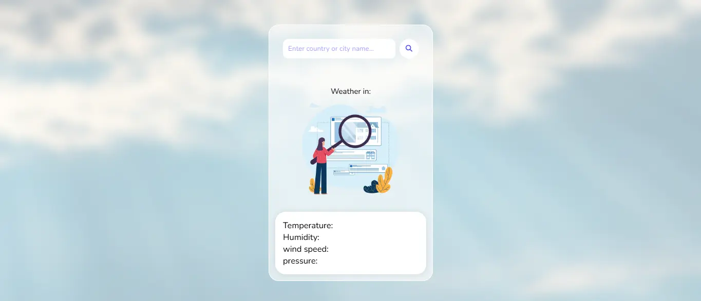
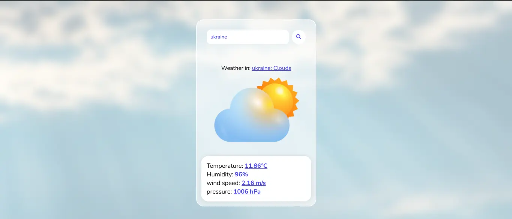
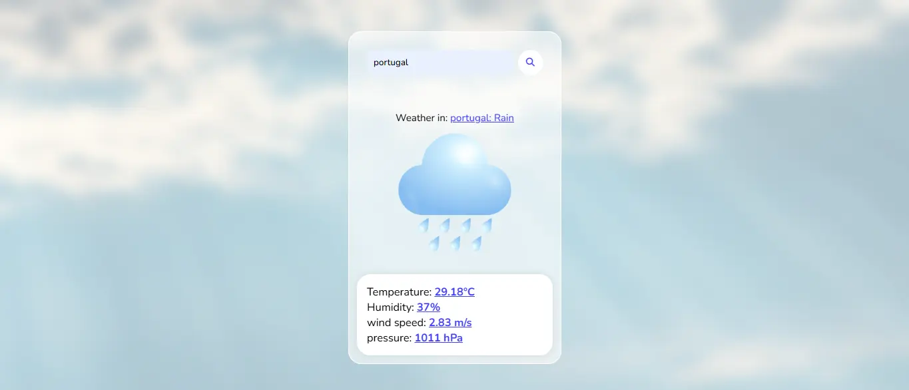

# ⛅ Weather App

**Weather App** is a sleek and modern web application that displays real-time weather information in a beautiful and responsive interface. Just enter by country or city name, and get instant weather updates with rich visuals and intuitive design.

---


## 🌟 Features

- 🌍 Real-time weather updates by city name
- 🌡️ Displays temperature, humidity, wind speed & pressure
- 🕒 Shows current time and dynamic weather icons
- 💡 User-friendly error messages and loading indicators

---

## 🚀 Demo

🔗 [Live Demo](./images/READMEimages&videos/README_video.mp4)

---

## 📸 Screenshots

| Home Screen | City Search | Mobile View |
|-------------|-------------|-------------|
|  |  |  |

---

## 🛠️ Tech Stack

- **Frontend**: HTML, CSS, JavaScript
- **API**: [OpenWeatherMap API](https://openweathermap.org/api)
- **Icons**: Feather Icons / Font Awesome / Weather Icons

---

## 📦 Installation

```bash
# Clone the repository
git clone https://github.com/shahzebkhan0/weatherApp.git

# Navigate to the project folder
cd weatherApp

# Open index.html in your browser
